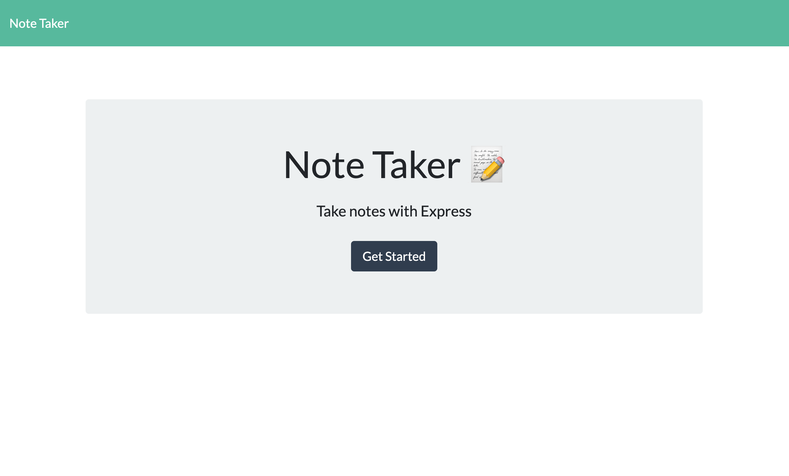
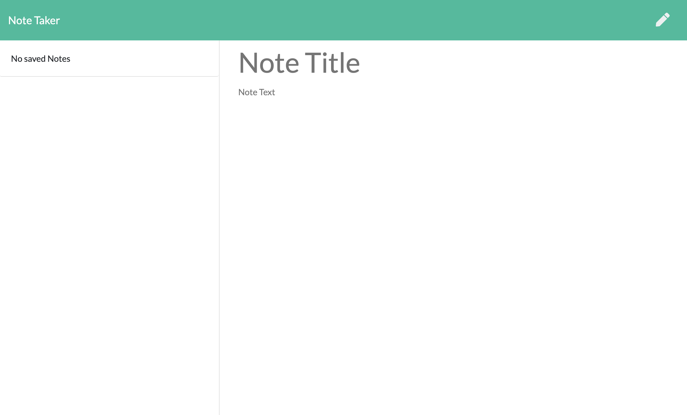
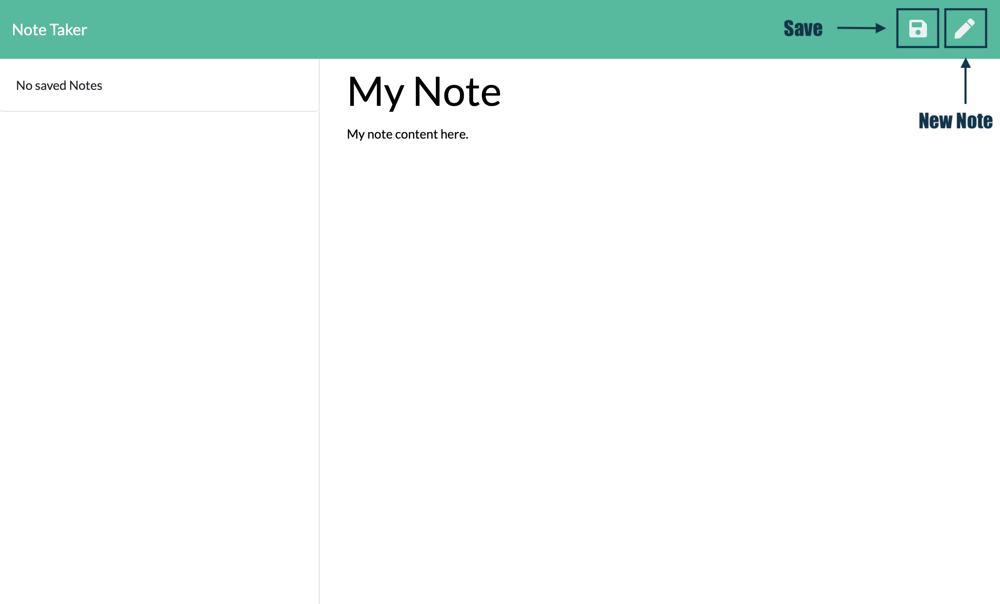
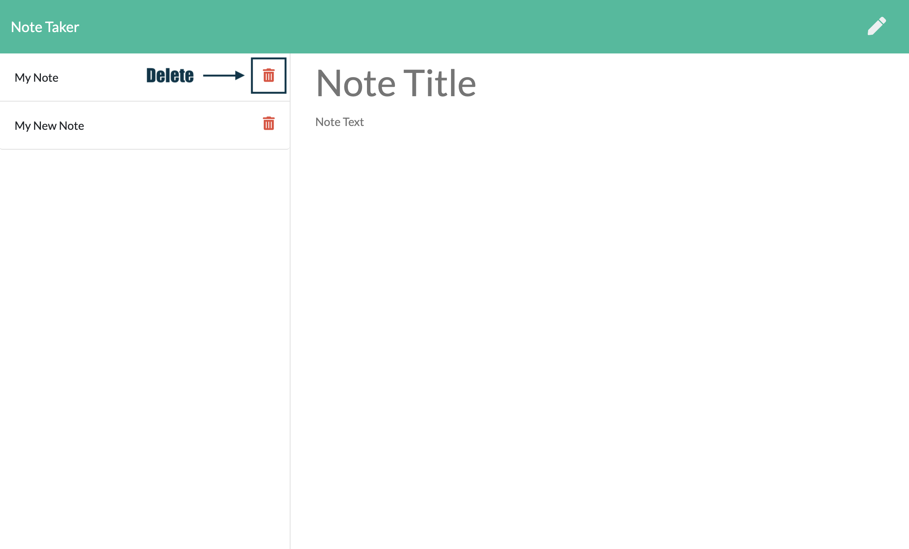
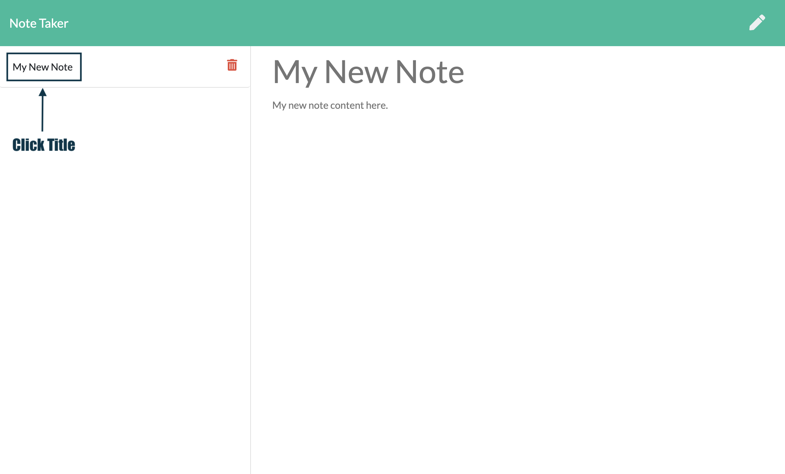

# Note Taker [](https://opensource.org/licenses/MIT)


## Description 

This application can be used to write, save, and delete notes. It uses an express backend and save and retrieve note data from a JSON file.


## Table of Contents 

* [Installation](#installation)
* [Usage](#usage)
* [License](#license)
* [Contribution](#contribution)
* [Tests](#tests)
* [Questions](#questions)


## Installation

Install dependencies:
```
npm install 
```

## Usage

[Deployed Application]()

### Home Page 



### Write & Save Notes

Click `Get Started` button to go to notes page.


Click on `save` icon to save your notes and click on `new note` icon to start a new note.


### Delete Notes

Click on `trash bin` icon to delete a note.


### Retrieve Saved Notes

Click on `note title` to retrieve any saved notes.



## License

```
Copyright 2020 Note Taker

Permission is hereby granted, free of charge, to any person obtaining a copy of this software and associated documentation files (the "Software"), to deal in   the Software without restriction, including without limitation the rights to use, copy, modify, merge, publish, distribute, sublicense, and/or sell copies of       the Software, and to permit persons to whom the Software is furnished to do so, subject to the following conditions:
    
The above copyright notice and this permission notice shall be included in all copies or substantial portions of the Software.
    
THE SOFTWARE IS PROVIDED "AS IS", WITHOUT WARRANTY OF ANY KIND, EXPRESS OR IMPLIED, INCLUDING BUT NOT LIMITED TO THE WARRANTIES OF MERCHANTABILITY, FITNESS FOR A PARTICULAR PURPOSE AND NONINFRINGEMENT. IN NO EVENT SHALL THE AUTHORS OR COPYRIGHT HOLDERS BE LIABLE FOR ANY CLAIM, DAMAGES OR OTHER LIABILITY, WHETHER IN AN     ACTION OF CONTRACT, TORT OR OTHERWISE, ARISING FROM, OUT OF OR IN CONNECTION WITH THE SOFTWARE OR THE USE OR OTHER DEALINGS IN THE SOFTWARE.
```


## Contribution 

No other contributions.

## Tests

None. 

## Questions 

GitHub Username: zhouyiartemiswang

GitHub Profile: [github.com/zhouyiartemiswang](https://github.com/zhouyiartemiswang) 

GitHub Repo: [github.com/zhouyiartemiswang/note_taker](https://github.com/zhouyiartemiswang/note_taker)

Please email additional questions to wzyzhouyi@gmail.com. 
